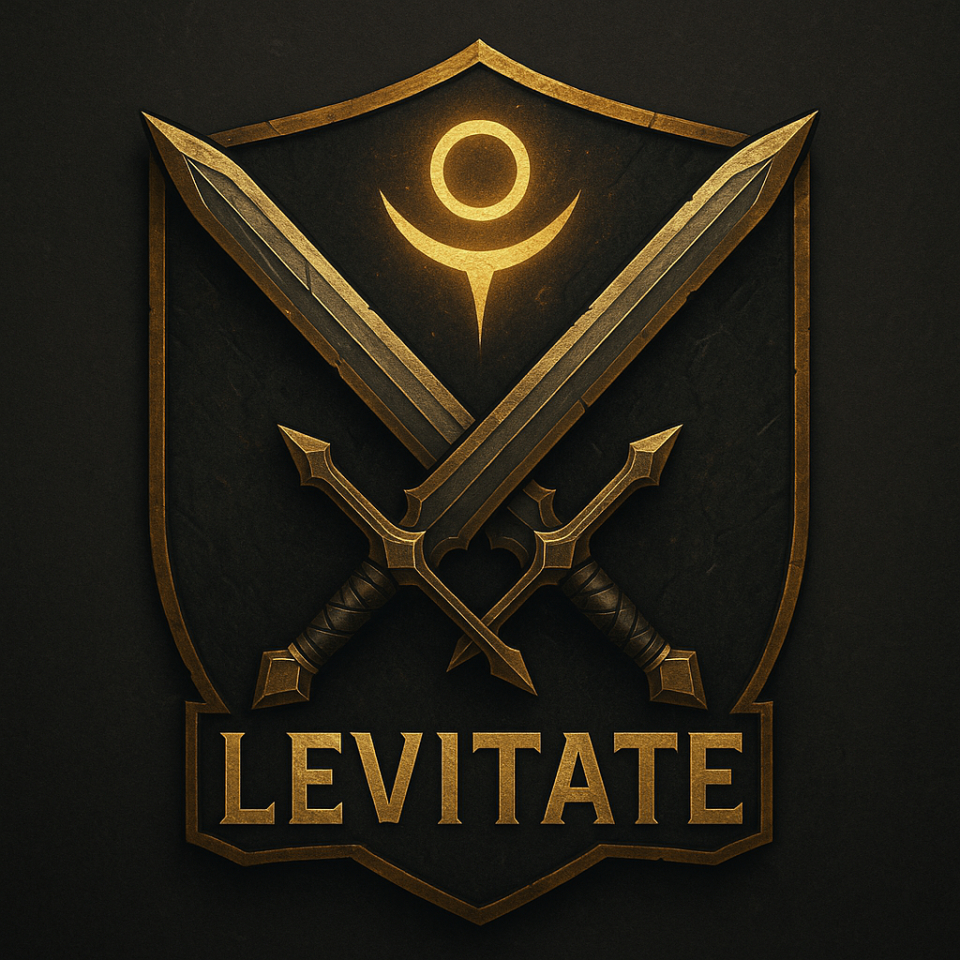

# ✨ Levitate – World of Warcraft Gildenwebsite

Willkommen auf der offiziellen Website der WoW-Gilde **Levitate** – Allianz | EU-Eredar  
Diese Seite wurde von Grund auf in **HTML, CSS und JavaScript** entwickelt.



---

## 🌐 Live-Demo

👉 [Jetzt ansehen](https://caethus.github.io/Levitate/)  
(Diese Seite wird über **GitHub Pages** gehostet)

---

## 📁 Projektstruktur

```plaintext
Levitate/
├── index.html
├── about.html
├── raids.html
├── bewerbung.html
├── kontakt.html
├── css/
│   ├── base.css
│   ├── layout.css
│   ├── components.css
│   └── typography.css
├── js/
│   └── main.js
└── assets/
    └── images/
        └── favicon.png
🎯 Features
Responsive Design (Desktop & Mobil)

Glow-Effekte & animiertes Menü

Hero-Sektion für die Startseite

Bewerbungsformular

Gildeninformationen & Raidübersicht

Favicon basierend auf dem Gildenlogo

🚀 Technologien
HTML5

CSS3 (modularisiert)

Vanilla JavaScript

Git & GitHub Pages

🧙‍♂️ Entwickler
Dieses Projekt wurde mit ❤️ von Caethus (Bastian) gebaut.
Aktuell in Umschulung zum Fachinformatiker für Anwendungsentwicklung.

📬 Kontakt
Bei Fragen, Vorschlägen oder Raidanfragen:
📧 Kontaktseite aufrufen

⚠️ Lizenz
Dieses Projekt ist rein privat und nicht kommerziell. Alle verwendeten Grafiken gehören der Gilde bzw. Blizzard Entertainment.
